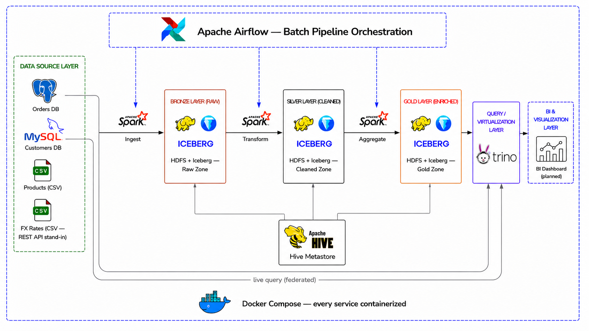

# Enterprise Lakehouse & Data Virtualization Platform

A batch-analytics Lakehouse for a (fictional) multinational retailer, built to
demonstrate the architecture a real data engineering team would use to unify
operational systems into governed, queryable analytics — without copying
every operational table into the warehouse.

## Architecture



<details>
<summary>Text version</summary>

```
 Postgres (orders)  MySQL (customers)  CSV (products)   CSV (fx rates)*
          │                 │                │                │
          └─────────────────┴───────┬────────┴────────────────┘
                                     │  extract (Spark, orchestrated by Airflow)
                                     ▼
                        ┌─────────────────────────┐
                        │   HDFS  +  Iceberg       │
                        │   bronze → silver → gold │
                        └────────────┬─────────────┘
                                     │  metadata
                                     ▼
                             Hive Metastore
                                     │
                                     ▼
                 ┌───────────────────────────────────────┐
                 │                 Trino                  │
                 │  joins: iceberg (bronze/silver/gold)    │
                 │       ⋈ postgresql (orders, live)       │
                 │       ⋈ mysql (customers, live)         │
                 └───────────────────┬───────────────────┘
                                     │
                                     ▼
                              Superset (BI)*
```

</details>

*fx rates is a documented CSV stand-in for a REST source; BI layer isn't
built. Both are scope cuts, not gaps: they're consumption-edge concerns
(how data gets out, how one source arrives) rather than the platform's
core problem — moving and transforming data through a governed Medallion
architecture with real DQ gating and multi-engine virtualization, which is
what the rest of this repo demonstrates and where the remaining time went.
If built, BI would be Superset over Trino (Dockerized, native Trino
connector, queries Gold through the same virtualization layer proven
above) rather than Power BI; fx rates would be a small Flask/FastAPI mock
replacing the CSV read with an HTTP GET, same data, different mechanism.

Full rationale for each built component — and the alternatives that were
rejected — is in [`docs/design-decisions.md`](docs/design-decisions.md).

## Quickstart

```bash
cp .env.example .env               # adjust ports if anything conflicts locally
cd docker/spark-jars && <run the two curl commands in docker/spark-jars/README.md> && cd ../..
docker compose up -d
```

The Hadoop/Spark/Hive cluster reuses existing local images
(`hadoop-hive-spark-master`/`-worker`/`-history`) rather than pulling
bde2020/bitnami/apache-hive images — see
[`docs/design-decisions.md`](docs/design-decisions.md), "Adopting Ahmed's
existing Hadoop/Spark/Hive images", for the full reverse-engineered wiring
and why several hostnames below aren't configurable. Airflow still builds
its own image on first run (adds the Spark/Trino providers on top of the
already-cached `apache/airflow:2.9.3`).

Check status with `docker compose ps`; everything should report healthy
before you start running DAGs.

| Service | UI / Endpoint | Default credentials |
|---|---|---|
| HDFS NameNode (on `master`) | http://localhost:9870 | — |
| Spark Master (on `master`) | http://localhost:8080 | — |
| Spark Worker (on `worker`) | http://localhost:8081 | — |
| Spark History Server | http://localhost:18080 | — |
| Hive Metastore (thrift, on `master`) | localhost:9083 | — |
| HiveServer2 (on `master`) | localhost:10000 | — |
| Trino | http://localhost:8082 | — |
| Airflow | http://localhost:8083 | admin / admin (change via `.env`) |
| Postgres (orders) | localhost:5432 | see `.env` |
| MySQL (customers) | localhost:3306 | see `.env` |
| Metastore's own Postgres | localhost:5434 | jupyter / jupyter (hardcoded in image) |

## Repo structure

```
enterprise-lakehouse/
├── docker/
│   ├── airflow/          custom Airflow image (adds Spark + Trino providers)
│   ├── hadoop/           hdfs-site.xml override (replication fix) + core-site.xml copy for Trino
│   ├── spark-jars/       Iceberg runtime + MySQL driver, fetched once (see its README)
│   └── trino/catalog/    iceberg / postgresql / mysql catalog configs
├── airflow/dags/         pipeline DAGs
├── spark/jobs/           bronze/, silver/, gold/, common/ — PySpark jobs, one file per table
├── generator/            synthetic data generator for the operational sources
├── tests/                unit tests for spark/jobs/common/ (pytest, local SparkSession — no Docker needed)
├── dashboards/           not built — see the Architecture note above
└── docs/                 design decisions and rationale (docs/design-decisions.md)
```

## Running the unit tests

Unit tests cover the pure-DataFrame logic in `spark/jobs/common/` (the DQ
check framework and the Silver dedup helper) against a local `local[1]`
SparkSession — no Docker, HDFS, or Iceberg catalog required:

```bash
pip install -r tests/requirements.txt
pytest tests/
```

## Build status

- [x] Repo scaffolding + `docker-compose.yml`
- [x] Synthetic data generator (`generator/`)
- [x] Bronze ingestion jobs (Spark reading Postgres/MySQL/CSV)
- [x] Silver transformations (dedupe, validation, quarantine)
- [x] Gold aggregates (`daily_sales`, `customer_360`, `monthly_revenue`, `inventory_summary`, `product_performance`)
- [x] Airflow DAG wiring the above together with a data-quality gate that
      actually blocks Gold on breach (per-table thresholds — see
      `DQ_THRESHOLDS_PCT` in the DAG), not just a logged warning
- [x] Incremental (watermark-based) Bronze extraction for orders,
      order_items, customers, exchange_rates; products stays full-refresh
      by design — see docs/design-decisions.md, "Incremental extraction
      and its limits," for what this does and does not catch
- [x] Unit tests for the DQ framework and Silver dedup logic (`tests/`)
- [x] Trino cross-catalog query demos (live federated Postgres ⋈ MySQL join, plus all Iceberg tables)
- [x] Full end-to-end DAG run, verified
- [ ] BI dashboard, mock REST API for fx rates — scope cut, not gaps: see the note under Architecture above

## A note on this being a portfolio project, not production

A few choices below trade production-grade rigor for something that boots
on a laptop — each is called out in `docs/design-decisions.md` along with
what the production equivalent would be, since that trade-off itself is a
reasonable thing to be asked about in an interview:

- HDFS replication factor is 1, not 3 (overridden — the baked-in image
  default was 3, which doesn't make sense with a single DataNode).
- Single NameNode (no HA/Standby), single Spark worker.
- `master` runs HDFS NameNode + YARN ResourceManager + Hive Metastore +
  HiveServer2 + Spark Master all in one container — inherited from the
  existing images this project reuses, not a from-scratch design choice.
  A real deployment would split these across dedicated nodes.
- Airflow runs `LocalExecutor` rather than `CeleryExecutor`/`KubernetesExecutor`.